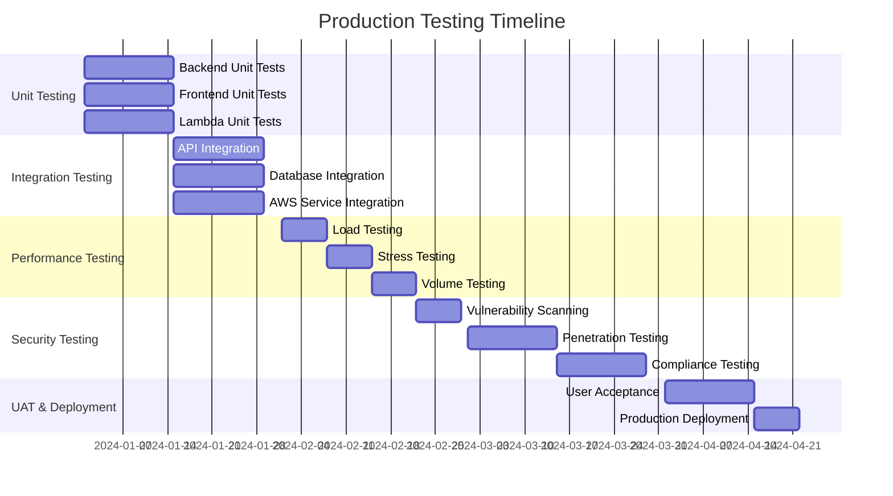

# Production Testing Strategy
## PII Encryption System - Production Deployment Testing Framework

**Date**: July 23, 2025  
**Version**: 1.0  
**Status**: Strategic Framework  
**Purpose**: Production deployment testing guidance

---

## Executive Summary

This document outlines the comprehensive testing strategy required for deploying the PII Encryption System prototype into a production environment. While the prototype has been successfully validated through manual testing, production deployment requires extensive automated testing, security validation, and compliance verification.

**Testing Scope**: This strategy covers all aspects of production readiness testing, from automated unit tests to comprehensive security assessments and compliance auditing.

**Implementation Note**: This document serves as a **strategic framework** for production testing rather than actual implementation, as the prototype has successfully demonstrated all core functionality.

---

## Testing Framework Overview

### Production Testing Pyramid

```
                    ┌─────────────────────┐
                    │   COMPLIANCE &      │
                    │   SECURITY AUDIT    │
                    │   (Regulatory)      │
                    └─────────────────────┘
                  ┌───────────────────────────┐
                  │   INTEGRATION TESTING     │
                  │   (End-to-End Scenarios)  │
                  └───────────────────────────┘
                ┌─────────────────────────────────┐
                │     PERFORMANCE TESTING         │
                │     (Load, Stress, Volume)      │
                └─────────────────────────────────┘
              ┌───────────────────────────────────────┐
              │        SECURITY TESTING               │
              │     (Penetration, Vulnerability)      │
              └───────────────────────────────────────┘
            ┌─────────────────────────────────────────────┐
            │           UNIT & COMPONENT TESTING          │
            │         (Automated Test Suites)             │
            └─────────────────────────────────────────────┘
```

---

## 1. Automated Testing Infrastructure

### 1.1 Unit Testing Framework

**Backend Testing (Python/FastAPI)**

```python
# Example Test Structure
# tests/unit/test_encryption_service.py

import pytest
from unittest.mock import Mock, patch
from pii_backend.lambda_client import LambdaClient
from pii_backend.models import UserCreateRequest

class TestEncryptionService:
    """Unit tests for encryption service functionality"""
    
    @pytest.fixture
    def lambda_client(self):
        return LambdaClient()
    
    @pytest.fixture
    def sample_user_data(self):
        return UserCreateRequest(
            email="test@example.com",
            first_name="John",
            last_name="Doe",
            ssn="123-45-6789"
        )
    
    def test_pii_classification_level1(self):
        """Test Level 1 PII field classification"""
        # Test that email is classified as Level 1
        pass
    
    def test_pii_classification_level2(self):
        """Test Level 2 PII field classification"""  
        # Test that address is classified as Level 2
        pass
    
    def test_pii_classification_level3(self):
        """Test Level 3 PII field classification"""
        # Test that SSN is classified as Level 3
        pass
    
    def test_encryption_round_trip(self):
        """Test encrypt/decrypt round trip for all levels"""
        # Test data integrity through encryption/decryption
        pass
```

**Frontend Testing (React/JavaScript)**

```javascript
// Example Test Structure  
// frontend/src/components/__tests__/UserForm.test.jsx

import { render, screen, fireEvent, waitFor } from '@testing-library/react'
import UserForm from '../UserForm'
import { api } from '../../services/api'

jest.mock('../../services/api')

describe('UserForm Component', () => {
  beforeEach(() => {
    jest.clearAllMocks()
  })

  test('displays PII level indicators correctly', () => {
    render(<UserForm onUserCreated={jest.fn()} />)
    
    // Test Level 1 indicators (green)
    expect(screen.getByText('🟢 L1')).toBeInTheDocument()
    
    // Test Level 2 indicators (orange)
    expect(screen.getByText('🟠 L2')).toBeInTheDocument()
    
    // Test Level 3 indicators (red)  
    expect(screen.getByText('🔴 L3')).toBeInTheDocument()
  })

  test('validates required fields', async () => {
    render(<UserForm onUserCreated={jest.fn()} />)
    
    const submitButton = screen.getByText('Create User')
    fireEvent.click(submitButton)
    
    await waitFor(() => {
      expect(screen.getByText('Email is required')).toBeInTheDocument()
    })
  })

  test('masks Level 3 data by default', () => {
    // Test that SSN field is masked on display
    // Test reveal/hide toggle functionality
  })
})
```

**Lambda Testing (Python)**

```python
# tests/unit/test_lambda_function.py

import pytest
import json
from unittest.mock import Mock, patch
from pii_encryption_lambda.lambda_function import lambda_handler

class TestLambdaFunction:
    """Unit tests for Lambda encryption function"""
    
    def test_create_user_success(self):
        """Test successful user creation with mixed PII levels"""
        event = {
            'operation': 'create_user',
            'data': {
                'email': 'test@example.com',
                'first_name': 'John',
                'ssn': '123-45-6789'
            }
        }
        
        # Mock AWS services
        with patch('boto3.client') as mock_boto3:
            result = lambda_handler(event, {})
            
            assert result['success'] == True
            assert 'user_id' in result['result']
    
    def test_encryption_level_assignment(self):
        """Test that fields receive correct encryption levels"""
        # Test PII classification logic
        pass
    
    def test_key_rotation_handling(self):
        """Test handling of multiple key versions"""
        # Test key version tracking
        pass
```

### 1.2 Test Coverage Requirements

**Coverage Targets**
- **Unit Tests**: 90% code coverage minimum
- **Integration Tests**: 85% API endpoint coverage
- **Security Tests**: 100% sensitive data path coverage
- **UI Tests**: 80% component coverage

**Test Categories**
```yaml
test_categories:
  unit_tests:
    backend:
      - encryption_service: 95% coverage
      - api_endpoints: 90% coverage
      - data_models: 100% coverage
      - error_handling: 85% coverage
    frontend:
      - components: 85% coverage
      - api_integration: 90% coverage
      - user_workflows: 90% coverage
    lambda:
      - encryption_logic: 100% coverage
      - database_operations: 95% coverage
      - audit_logging: 100% coverage
```

---

## 2. Integration Testing Strategy

### 2.1 End-to-End Test Scenarios

**Scenario 1: Complete User Lifecycle**
```python
# tests/integration/test_user_lifecycle.py

class TestUserLifecycle:
    """Integration tests for complete user data lifecycle"""
    
    def test_complete_user_journey(self):
        """Test: Create → Store → Retrieve → Display → Delete"""
        
        # Step 1: Create user through API
        user_data = {
            'email': 'integration@test.com',
            'first_name': 'Integration',
            'last_name': 'Test',
            'ssn': '987-65-4321'
        }
        
        # POST /users
        create_response = requests.post('/users', json=user_data)
        assert create_response.status_code == 200
        user_id = create_response.json()['data']['user_id']
        
        # Step 2: Verify data stored with correct encryption
        # (Database verification through Lambda)
        
        # Step 3: Retrieve user data
        # GET /users/{user_id}
        get_response = requests.get(f'/users/{user_id}')
        assert get_response.status_code == 200
        
        retrieved_data = get_response.json()['data']
        
        # Step 4: Verify data integrity
        assert retrieved_data['email'] == user_data['email']
        assert retrieved_data['ssn'] == user_data['ssn']
        
        # Step 5: Verify audit logging
        audit_response = requests.get(f'/users/{user_id}/audit')
        audit_logs = audit_response.json()['data']['logs']
        
        assert len(audit_logs) >= 2  # Create + Retrieve operations
        
        # Step 6: Clean up (optional for integration tests)
        # DELETE /users/{user_id}
```

**Scenario 2: Multi-Level Encryption Validation**
```python
def test_three_tier_encryption_integration(self):
    """Test all three encryption levels in single user"""
    
    user_data = {
        # Level 1 fields
        'email': 'test@example.com',
        'first_name': 'Test',
        'last_name': 'User',
        
        # Level 2 fields  
        'address': '123 Test Street',
        'date_of_birth': '1990-01-01',
        
        # Level 3 fields
        'ssn': '123-45-6789',
        'credit_card': '4111111111111111'
    }
    
    # Create user
    response = requests.post('/users', json=user_data)
    user_id = response.json()['data']['user_id']
    
    # Verify database storage (through Lambda query)
    # - Level 1: plaintext
    # - Level 2: KMS encrypted
    # - Level 3: double encrypted
    
    # Verify retrieval and decryption
    retrieved = requests.get(f'/users/{user_id}')
    data = retrieved.json()['data']
    
    # All data should be properly decrypted
    assert data['email'] == user_data['email']
    assert data['address'] == user_data['address'] 
    assert data['ssn'] == user_data['ssn']
```

### 2.2 API Integration Testing

**API Contract Testing**
```python
# tests/integration/test_api_contracts.py

class TestAPIContracts:
    """Validate API request/response contracts"""
    
    def test_create_user_contract(self):
        """Test POST /users request/response structure"""
        
        # Valid request
        valid_request = {
            'email': 'test@example.com',
            'first_name': 'Test'
        }
        
        response = requests.post('/users', json=valid_request)
        
        # Validate response structure
        assert response.status_code == 200
        response_data = response.json()
        
        # Required response fields
        assert 'success' in response_data
        assert 'message' in response_data
        assert 'data' in response_data
        assert 'user_id' in response_data['data']
    
    def test_error_response_contracts(self):
        """Test error response formats"""
        
        # Invalid request
        invalid_request = {'invalid': 'data'}
        
        response = requests.post('/users', json=invalid_request)
        
        assert response.status_code == 422
        error_data = response.json()
        
        assert 'detail' in error_data
        # Validate error structure matches FastAPI format
```

### 2.3 Database Integration Testing

**Database State Validation**
```python
# tests/integration/test_database_integration.py

class TestDatabaseIntegration:
    """Test database operations and data integrity"""
    
    def test_encryption_metadata_tracking(self):
        """Test encryption metadata is properly stored"""
        
        # Create user with Level 2 and Level 3 data
        user_data = {
            'email': 'db@test.com',
            'address': '123 DB Test Street',  # Level 2
            'ssn': '111-22-3333'  # Level 3
        }
        
        response = requests.post('/users', json=user_data)
        user_id = response.json()['data']['user_id']
        
        # Validate encryption metadata table
        # (Would require direct database access or Lambda query)
        
        # Check that metadata exists for encrypted fields
        # Check key versions are recorded
        # Check encryption algorithms are documented
    
    def test_audit_trail_completeness(self):
        """Test that all operations are properly audited"""
        
        # Perform various operations
        user_id = self.create_test_user()
        requests.get(f'/users/{user_id}')  # Read
        requests.get(f'/users/{user_id}')  # Another read
        
        # Verify audit entries
        audit_response = requests.get(f'/users/{user_id}/audit')
        logs = audit_response.json()['data']['logs']
        
        # Should have create + 2 read operations
        assert len(logs) == 3
        
        # Verify audit log structure
        for log in logs:
            assert 'timestamp' in log
            assert 'operation_type' in log
            assert 'success' in log
```

---

## 3. Performance Testing Strategy

### 3.1 Load Testing Framework

**Apache JMeter Test Plans**

```xml
<!-- Example JMeter Test Plan Structure -->
<TestPlan>
  <name>PII Encryption System Load Test</name>
  
  <ThreadGroup>
    <name>User Creation Load Test</name>
    <num_threads>100</num_threads>
    <ramp_time>60</ramp_time>
    <duration>300</duration>
    
    <HTTPRequest>
      <path>/users</path>
      <method>POST</method>
      <body>{
        "email": "loadtest${__threadNum}@example.com",
        "first_name": "Load",
        "last_name": "Test${__threadNum}",
        "ssn": "${__Random(100000000,999999999)}"
      }</body>
    </HTTPRequest>
  </ThreadGroup>
</TestPlan>
```

**Performance Benchmarks**
```yaml
performance_targets:
  response_time:
    user_creation: "<2 seconds (95th percentile)"
    user_retrieval: "<500ms (95th percentile)"  
    user_listing: "<1 second (95th percentile)"
    
  throughput:
    concurrent_users: "500 simultaneous users"
    requests_per_second: "100 RPS sustained"
    daily_volume: "1M operations per day"
    
  resource_utilization:
    lambda_memory: "<512MB per invocation"
    database_connections: "<100 concurrent"
    api_gateway_limits: "Within AWS limits"
```

### 3.2 Stress Testing Scenarios

**Scenario 1: Lambda Cold Start Impact**
```python
# tests/performance/test_lambda_performance.py

def test_lambda_cold_start_performance():
    """Test performance impact of Lambda cold starts"""
    
    # Test with no recent Lambda activity (cold start)
    start_time = time.time()
    response = requests.post('/users', json=test_user_data)
    cold_start_time = time.time() - start_time
    
    # Test with recent Lambda activity (warm start)  
    start_time = time.time()
    response = requests.post('/users', json=test_user_data2)
    warm_start_time = time.time() - start_time
    
    # Analyze performance difference
    assert cold_start_time < 5.0  # Cold start under 5 seconds
    assert warm_start_time < 1.0  # Warm start under 1 second
```

**Scenario 2: Database Connection Pool Testing**
```python
def test_database_connection_scaling():
    """Test database performance under concurrent load"""
    
    import concurrent.futures
    
    def create_user_request():
        return requests.post('/users', json=generate_test_user())
    
    # Test with increasing concurrent requests
    with concurrent.futures.ThreadPoolExecutor(max_workers=50) as executor:
        futures = [executor.submit(create_user_request) for _ in range(100)]
        
        results = [future.result() for future in futures]
        
        # Analyze response times and success rates
        success_count = sum(1 for r in results if r.status_code == 200)
        assert success_count >= 95  # 95% success rate minimum
```

### 3.3 Volume Testing

**Data Volume Scenarios**
```python
def test_large_dataset_performance():
    """Test system performance with large datasets"""
    
    # Create baseline of 10,000 users
    for i in range(10000):
        create_test_user(f"volume{i}@test.com")
    
    # Test user listing performance
    start_time = time.time()
    response = requests.get('/users?limit=50&offset=0')
    list_time = time.time() - start_time
    
    assert list_time < 2.0  # Should complete within 2 seconds
    assert response.status_code == 200
    
    # Test search performance
    start_time = time.time()
    response = requests.get('/users?search=volume5000')
    search_time = time.time() - start_time
    
    assert search_time < 1.0  # Search should be fast
```

---

## 4. Security Testing Framework

### 4.1 Automated Security Testing

**OWASP ZAP Integration**
```yaml
# .zap/automation/zap-baseline-scan.yaml
env:
  contexts:
    - name: "PII Encryption API"
      urls: 
        - "https://api.pii-system.example.com"
      authentication:
        method: "scriptBasedAuthentication"
        script: "api-key-auth.js"

jobs:
  - type: "spider"
    parameters:
      context: "PII Encryption API"
      url: "https://api.pii-system.example.com"
      
  - type: "activeScan"
    parameters:
      context: "PII Encryption API"
      policy: "API-Minimal"
      
  - type: "report"
    parameters:
      template: "traditional-json"
      reportFile: "zap-report.json"
```

**SQL Injection Testing**
```python
# tests/security/test_injection_attacks.py

class TestInjectionAttacks:
    """Test system resistance to injection attacks"""
    
    def test_sql_injection_resistance(self):
        """Test API endpoints against SQL injection"""
        
        injection_payloads = [
            "'; DROP TABLE users; --",
            "' OR '1'='1",
            "'; UPDATE users SET email='hacked@evil.com'; --"
        ]
        
        for payload in injection_payloads:
            malicious_data = {
                'email': payload,
                'first_name': 'Test'
            }
            
            response = requests.post('/users', json=malicious_data)
            
            # Should either reject input or safely handle it
            assert response.status_code in [400, 422]  # Validation error
            
            # Verify database integrity (no data corruption)
            self.verify_database_integrity()
    
    def test_nosql_injection_resistance(self):
        """Test resistance to NoSQL injection patterns"""
        # Test MongoDB-style injection patterns
        pass
    
    def test_command_injection_resistance(self):
        """Test resistance to OS command injection"""
        # Test system command injection attempts
        pass
```

### 4.2 Penetration Testing Strategy

**External Penetration Testing**
```markdown
## Penetration Testing Scope

### In-Scope Targets
- API endpoints (https://api.pii-system.example.com)
- Frontend application (https://app.pii-system.example.com)
- Authentication mechanisms
- Data encryption implementations

### Out-of-Scope
- AWS infrastructure (managed by AWS)
- Third-party services (unless integration points)
- Physical security
- Social engineering

### Testing Methodology
1. **Information Gathering**
   - API endpoint discovery
   - Technology stack fingerprinting
   - Error message analysis

2. **Vulnerability Assessment**
   - OWASP Top 10 testing
   - API security testing
   - Authentication bypass attempts

3. **Exploitation Attempts**
   - Privilege escalation
   - Data access attempts
   - Encryption bypass attempts

4. **Post-Exploitation Analysis**
   - Data exposure assessment
   - Lateral movement possibilities
   - Audit trail evaluation
```

**Vulnerability Scanning**
```python
# tests/security/test_vulnerability_scanning.py

def test_dependency_vulnerabilities():
    """Test for known vulnerabilities in dependencies"""
    
    # Python backend dependencies
    result = subprocess.run([
        'safety', 'check', '--json'
    ], capture_output=True, text=True)
    
    vulnerabilities = json.loads(result.stdout)
    
    # Should have no high or critical vulnerabilities
    critical_vulns = [v for v in vulnerabilities if v['severity'] == 'critical']
    assert len(critical_vulns) == 0
    
    # Frontend dependencies (npm audit)
    result = subprocess.run([
        'npm', 'audit', '--json'
    ], cwd='frontend', capture_output=True, text=True)
    
    audit_data = json.loads(result.stdout)
    assert audit_data['metadata']['vulnerabilities']['critical'] == 0
```

### 4.3 Cryptographic Validation

**Encryption Strength Testing**
```python
# tests/security/test_cryptographic_validation.py

class TestCryptographicValidation:
    """Validate encryption implementations"""
    
    def test_encryption_algorithm_strength(self):
        """Verify strong encryption algorithms are used"""
        
        # Test KMS key specifications
        kms_client = boto3.client('kms')
        
        # Verify Level 2 key
        level2_key = kms_client.describe_key(KeyId='alias/pii-level2')
        assert level2_key['KeySpec'] == 'SYMMETRIC_DEFAULT'
        assert level2_key['KeyUsage'] == 'ENCRYPT_DECRYPT'
        
        # Verify Level 3 key
        level3_key = kms_client.describe_key(KeyId='alias/pii-level3')
        assert level3_key['KeySpec'] == 'SYMMETRIC_DEFAULT'
    
    def test_key_rotation_compliance(self):
        """Test key rotation is properly configured"""
        
        kms_client = boto3.client('kms')
        
        # Check key rotation status
        rotation_status = kms_client.get_key_rotation_status(
            KeyId='alias/pii-level2'
        )
        assert rotation_status['KeyRotationEnabled'] == True
    
    def test_encryption_randomness(self):
        """Test that encryption produces different outputs for same input"""
        
        # Encrypt same data multiple times
        test_data = "sensitive information"
        
        encrypted_1 = encrypt_data(test_data, encryption_level=3)
        encrypted_2 = encrypt_data(test_data, encryption_level=3)
        
        # Should produce different ciphertext (due to IV/nonce)
        assert encrypted_1 != encrypted_2
        
        # But should decrypt to same plaintext
        assert decrypt_data(encrypted_1) == test_data
        assert decrypt_data(encrypted_2) == test_data
```

---

## 5. Compliance Testing

### 5.1 GDPR Compliance Testing

**Right to Erasure Testing**
```python
# tests/compliance/test_gdpr_compliance.py

class TestGDPRCompliance:
    """Test GDPR compliance features"""
    
    def test_right_to_erasure(self):
        """Test Article 17 - Right to erasure"""
        
        # Create user
        user_data = {'email': 'gdpr@test.com', 'first_name': 'GDPR'}
        response = requests.post('/users', json=user_data)
        user_id = response.json()['data']['user_id']
        
        # Verify user exists
        get_response = requests.get(f'/users/{user_id}')
        assert get_response.status_code == 200
        
        # Delete user (simulated - not implemented in prototype)
        delete_response = requests.delete(f'/users/{user_id}')
        # Would expect 200 or 204 response
        
        # Verify user no longer accessible
        get_after_delete = requests.get(f'/users/{user_id}')
        assert get_after_delete.status_code == 404
        
        # Verify audit trail shows deletion
        # Check that data is cryptographically shredded
    
    def test_data_minimization(self):
        """Test Article 5 - Data minimization principle"""
        
        # Attempt to create user with excessive data
        excessive_data = {
            'email': 'minimal@test.com',
            'first_name': 'Test',
            'unnecessary_field': 'should be rejected'
        }
        
        response = requests.post('/users', json=excessive_data)
        
        # System should reject unnecessary fields
        # Or ignore them (depending on implementation)
        # Verify only necessary data is stored
    
    def test_data_portability(self):
        """Test Article 20 - Right to data portability"""
        
        # Create user with various data types
        user_data = {
            'email': 'portable@test.com',
            'first_name': 'Portable',
            'address': '123 Portable Street',
            'ssn': '123-45-6789'
        }
        
        response = requests.post('/users', json=user_data)
        user_id = response.json()['data']['user_id']
        
        # Request data export (would need to implement)
        export_response = requests.get(f'/users/{user_id}/export')
        
        # Verify all user data is included
        # Verify data is in machine-readable format
        # Verify data includes metadata about processing
```

### 5.2 PCI DSS Compliance Testing

**Cardholder Data Protection Testing**
```python
# tests/compliance/test_pci_dss_compliance.py

class TestPCIDSSCompliance:
    """Test PCI DSS compliance for credit card data"""
    
    def test_cardholder_data_encryption(self):
        """Test Requirement 3 - Protect stored cardholder data"""
        
        # Create user with credit card data
        user_data = {
            'email': 'card@test.com',
            'first_name': 'Card',
            'credit_card': '4111111111111111'
        }
        
        response = requests.post('/users', json=user_data)
        user_id = response.json()['data']['user_id']
        
        # Verify credit card data receives Level 3 encryption
        # (Would need database access to verify encryption)
        
        # Verify no plaintext credit card data in logs
        self.verify_no_plaintext_in_logs('4111111111111111')
        
        # Test data retrieval
        get_response = requests.get(f'/users/{user_id}')
        retrieved_data = get_response.json()['data']
        
        assert retrieved_data['credit_card'] == '4111111111111111'
    
    def test_access_control_restrictions(self):
        """Test Requirement 7 - Restrict access by business need"""
        
        # Test that API requires authentication
        no_auth_response = requests.get('/users/test-id')
        assert no_auth_response.status_code in [401, 403]
        
        # Test with valid API key
        headers = {'Authorization': 'Bearer valid-api-key'}
        auth_response = requests.get('/users/test-id', headers=headers)
        # Should succeed or return 404 for non-existent user
        assert auth_response.status_code in [200, 404]
    
    def test_audit_trail_requirements(self):
        """Test Requirement 10 - Log and monitor all access"""
        
        # Perform credit card data operations
        user_id = self.create_user_with_credit_card()
        requests.get(f'/users/{user_id}')  # Access operation
        
        # Verify comprehensive audit logging
        audit_response = requests.get(f'/users/{user_id}/audit')
        logs = audit_response.json()['data']['logs']
        
        # Should log creation and access
        assert len(logs) >= 2
        
        # Verify log completeness
        for log in logs:
            assert 'timestamp' in log
            assert 'operation_type' in log
            assert 'user_id' in log
            assert 'success' in log
```

### 5.3 SOX Compliance Testing

**Internal Controls Testing**
```python
# tests/compliance/test_sox_compliance.py

class TestSOXCompliance:
    """Test SOX compliance for financial data controls"""
    
    def test_data_integrity_controls(self):
        """Test Section 404 - Data integrity controls"""
        
        # Create user with financial data
        user_data = {
            'email': 'sox@test.com',
            'bank_account': '1234567890'
        }
        
        response = requests.post('/users', json=user_data)
        user_id = response.json()['data']['user_id']
        
        # Verify data integrity through multiple retrievals
        for _ in range(5):
            get_response = requests.get(f'/users/{user_id}')
            data = get_response.json()['data']
            assert data['bank_account'] == '1234567890'
        
        # Verify audit trail shows consistent data access
        audit_response = requests.get(f'/users/{user_id}/audit')
        logs = audit_response.json()['data']['logs']
        
        # All operations should be successful
        for log in logs:
            assert log['success'] == True
    
    def test_segregation_of_duties(self):
        """Test proper separation of system roles"""
        
        # Verify different system components have different permissions
        # Lambda role vs API role vs database access
        
        # Test that API cannot directly access database
        # Test that Lambda cannot directly serve HTTP requests
        # Test that database cannot perform encryption operations
        pass
```

---

## 6. Monitoring and Observability Testing

### 6.1 Application Performance Monitoring (APM)

**AWS X-Ray Integration Testing**
```python
# tests/monitoring/test_apm_integration.py

def test_distributed_tracing():
    """Test end-to-end request tracing"""
    
    # Enable X-Ray tracing for test
    with patch.dict(os.environ, {'_X_AMZN_TRACE_ID': 'test-trace-id'}):
        
        # Make request that spans multiple services
        response = requests.post('/users', json=test_user_data)
        
        # Verify trace data is captured
        # API Gateway → Lambda → Database should be traced
        
        # Test trace analysis
        # Verify performance bottlenecks are identifiable
        # Verify error paths are properly traced
```

**CloudWatch Metrics Testing**
```python
def test_custom_metrics_collection():
    """Test custom application metrics"""
    
    # Perform operations that should generate metrics
    requests.post('/users', json=test_data)  # Success metric
    requests.post('/users', json=invalid_data)  # Error metric
    
    # Wait for metrics to be published
    time.sleep(60)
    
    # Query CloudWatch for custom metrics
    cloudwatch = boto3.client('cloudwatch')
    
    # Verify success/error rates are tracked
    metrics = cloudwatch.get_metric_statistics(
        Namespace='PII/Encryption',
        MetricName='UserCreationSuccess',
        StartTime=datetime.now() - timedelta(minutes=5),
        EndTime=datetime.now(),
        Period=60,
        Statistics=['Sum']
    )
    
    assert len(metrics['Datapoints']) > 0
```

### 6.2 Security Monitoring Testing

**Anomaly Detection Testing**
```python
# tests/monitoring/test_security_monitoring.py

def test_suspicious_activity_detection():
    """Test detection of suspicious usage patterns"""
    
    # Simulate suspicious activity
    for _ in range(100):  # Rapid requests
        requests.post('/users', json=test_user_data)
    
    # Verify rate limiting is triggered
    response = requests.post('/users', json=test_user_data)
    assert response.status_code == 429  # Too Many Requests
    
    # Verify suspicious activity is logged
    # Check CloudWatch alarms are triggered
    # Verify security team notifications
```

**Audit Log Analysis Testing**
```python
def test_audit_log_analysis():
    """Test automated audit log analysis"""
    
    # Generate various audit events
    user_id = create_test_user()
    access_user_data(user_id)
    attempt_unauthorized_access()
    
    # Test log aggregation and analysis
    # Verify pattern detection
    # Test compliance reporting generation
```

---

## 7. Disaster Recovery and Business Continuity Testing

### 7.1 Backup and Recovery Testing

**Data Backup Validation**
```python
# tests/disaster_recovery/test_backup_recovery.py

def test_database_backup_recovery():
    """Test database backup and recovery procedures"""
    
    # Create test data
    original_users = []
    for i in range(10):
        user_data = create_test_user_data(f"backup{i}")
        response = requests.post('/users', json=user_data)
        original_users.append(response.json()['data'])
    
    # Trigger backup (would be automated in production)
    # Simulate data loss scenario
    # Restore from backup
    # Verify data integrity after restore
    
    for user in original_users:
        response = requests.get(f"/users/{user['user_id']}")
        assert response.status_code == 200
        # Verify decryption still works after restore
```

**Key Recovery Testing**
```python
def test_encryption_key_recovery():
    """Test recovery of encryption keys"""
    
    # Create encrypted data
    user_data = {'email': 'recovery@test.com', 'ssn': '123-45-6789'}
    response = requests.post('/users', json=user_data)
    user_id = response.json()['data']['user_id']
    
    # Simulate key rotation/recovery scenario
    # Test that old data can still be decrypted
    # Test that new keys work for new data
    
    # Verify backward compatibility
    get_response = requests.get(f'/users/{user_id}')
    assert get_response.status_code == 200
    assert get_response.json()['data']['ssn'] == '123-45-6789'
```

### 7.2 Failover Testing

**Multi-AZ Failover Testing**
```python
def test_database_failover():
    """Test RDS Aurora failover capabilities"""
    
    # Create test data
    user_id = create_test_user()
    
    # Simulate primary database failure
    # (Would require coordination with AWS)
    
    # Verify service continues with secondary
    response = requests.get(f'/users/{user_id}')
    assert response.status_code == 200
    
    # Test recovery time objectives (RTO)
    # Test recovery point objectives (RPO)
```

---

## 8. User Acceptance Testing (UAT)

### 8.1 Business Scenario Testing

**Scenario: Healthcare Provider PII Management**
```python
# tests/uat/test_healthcare_scenarios.py

def test_healthcare_provider_workflow():
    """Test healthcare provider managing patient PII"""
    
    # Patient registration scenario
    patient_data = {
        'email': 'patient@hospital.com',
        'first_name': 'John',
        'last_name': 'Patient',
        'address': '123 Hospital Drive',
        'ssn': '123-45-6789',
        'date_of_birth': '1980-01-01'
    }
    
    # Create patient record
    response = requests.post('/users', json=patient_data)
    patient_id = response.json()['data']['user_id']
    
    # Healthcare provider access scenario
    # Verify appropriate data masking in UI
    # Test audit trail for HIPAA compliance
    
    # Patient data export scenario (GDPR Article 20)
    export_response = requests.get(f'/users/{patient_id}/export')
    # Verify complete data export capability
```

**Scenario: Financial Services KYC Process**
```python
def test_financial_services_kyc():
    """Test Know Your Customer (KYC) data handling"""
    
    # Customer onboarding with financial data
    customer_data = {
        'email': 'customer@bank.com',
        'first_name': 'Financial',
        'last_name': 'Customer',
        'ssn': '987-65-4321',
        'bank_account': '9876543210',
        'credit_card': '4111111111111111'
    }
    
    # Test KYC data collection
    response = requests.post('/users', json=customer_data)
    customer_id = response.json()['data']['user_id']
    
    # Verify PCI DSS compliance for credit card data
    # Test audit trail for regulatory reporting
    # Verify data retention policies
```

### 8.2 Usability Testing Framework

**Frontend Usability Testing**
```javascript
// tests/uat/usability/test_user_interface.js

describe('User Interface Usability', () => {
  test('PII level indicators are intuitive', () => {
    // Test with non-technical users
    // Verify color coding is understood
    // Test data masking reveals are intuitive
    // Verify error messages are user-friendly
  })

  test('Navigation workflow is logical', () => {
    // Test user journey through all screens
    // Verify back/forward navigation works
    // Test mobile responsive design
  })

  test('Data entry process is efficient', () => {
    // Test form completion time
    // Verify validation feedback is helpful
    // Test auto-population features
  })
})
```

---

## 9. Deployment Testing Strategy

### 9.1 Environment Testing

**Multi-Environment Validation**
```yaml
# .github/workflows/multi-env-testing.yml

name: Multi-Environment Testing
on: [push, pull_request]

jobs:
  test-environments:
    strategy:
      matrix:
        environment: [dev, staging, prod-like]
    
    runs-on: ubuntu-latest
    
    steps:
      - name: Deploy to ${{ matrix.environment }}
        run: |
          # Deploy application to environment
          # Run environment-specific tests
          # Validate configuration differences
      
      - name: Run Integration Tests
        run: |
          # Run full integration test suite
          # Validate environment-specific configurations
          # Test environment-specific AWS resources
      
      - name: Performance Baseline
        run: |
          # Establish performance baselines for each environment
          # Compare performance across environments
```

**Configuration Validation**
```python
# tests/deployment/test_configuration.py

def test_environment_configuration():
    """Validate configuration across environments"""
    
    environments = ['dev', 'staging', 'production']
    
    for env in environments:
        # Validate environment-specific settings
        config = load_environment_config(env)
        
        # Security settings
        assert config['https_only'] == True
        assert config['debug_mode'] == (env != 'production')
        
        # AWS resource configuration
        assert config['kms_key_alias'].startswith('alias/pii-')
        assert config['database_encrypted'] == True
        
        # Performance settings
        if env == 'production':
            assert config['lambda_memory'] >= 512
            assert config['database_instance_class'].startswith('db.r')
```

### 9.2 Blue-Green Deployment Testing

**Zero-Downtime Deployment Validation**
```python
# tests/deployment/test_blue_green_deployment.py

def test_zero_downtime_deployment():
    """Test blue-green deployment process"""
    
    # Establish baseline with current version (blue)
    baseline_response = requests.get('/health')
    assert baseline_response.status_code == 200
    
    # Deploy new version (green)
    deploy_new_version()
    
    # Validate green environment
    green_health = requests.get('/health', 
                               headers={'X-Environment': 'green'})
    assert green_health.status_code == 200
    
    # Test backward compatibility
    test_data_compatibility()
    
    # Switch traffic to green
    switch_traffic_to_green()
    
    # Validate seamless transition
    post_switch_response = requests.get('/health')
    assert post_switch_response.status_code == 200
    
    # Verify no data loss during switch
    verify_data_integrity()
```

---

## 10. Testing Tools and Infrastructure

### 10.1 Testing Tool Stack

**Automated Testing Tools**
```yaml
testing_tools:
  unit_testing:
    backend: "pytest (Python), coverage.py"
    frontend: "Jest, React Testing Library"
    lambda: "pytest, moto (AWS mocking)"
  
  integration_testing:
    api: "requests, pytest-asyncio"
    database: "SQLAlchemy, pytest-postgresql"
    aws: "boto3, moto"
  
  performance_testing:
    load: "Apache JMeter, Locust"
    stress: "Artillery.io, k6"
    monitoring: "AWS X-Ray, CloudWatch"
  
  security_testing:
    vulnerability: "OWASP ZAP, Bandit"
    dependency: "Safety (Python), npm audit"
    secrets: "TruffleHog, git-secrets"
  
  compliance_testing:
    gdpr: "Custom test suite"
    pci_dss: "PCI compliance scanner"
    audit: "Custom audit validation"
```

**CI/CD Pipeline Integration**
```yaml
# .github/workflows/comprehensive-testing.yml

name: Comprehensive Testing Pipeline
on: [push, pull_request]

jobs:
  unit-tests:
    runs-on: ubuntu-latest
    steps:
      - uses: actions/checkout@v2
      - name: Run Unit Tests
        run: |
          pytest tests/unit/ --cov=src --cov-report=xml
          npm test -- --coverage
  
  integration-tests:
    needs: unit-tests
    runs-on: ubuntu-latest
    steps:
      - name: Setup Test Environment
        run: docker-compose -f docker-compose.test.yml up -d
      - name: Run Integration Tests
        run: pytest tests/integration/
  
  security-tests:
    needs: unit-tests
    runs-on: ubuntu-latest
    steps:
      - name: Vulnerability Scan
        run: |
          safety check
          bandit -r src/
          npm audit
      - name: OWASP ZAP Scan
        run: zap-baseline.py -t ${{ env.API_URL }}
  
  performance-tests:
    needs: integration-tests
    runs-on: ubuntu-latest
    steps:
      - name: Load Testing
        run: jmeter -n -t tests/performance/load-test.jmx
      - name: Performance Analysis
        run: python tests/performance/analyze_results.py
```

### 10.2 Test Data Management

**Test Data Strategy**
```python
# tests/fixtures/test_data_factory.py

class TestDataFactory:
    """Generate consistent test data across test suites"""
    
    @staticmethod
    def create_level1_user():
        """Create user with only Level 1 PII"""
        return {
            'email': 'level1@test.com',
            'first_name': 'Level',
            'last_name': 'One',
            'phone': '5551234567'
        }
    
    @staticmethod
    def create_level2_user():
        """Create user with Level 1 and Level 2 PII"""
        return {
            **TestDataFactory.create_level1_user(),
            'address': '123 Test Street, Test City, TS 12345',
            'date_of_birth': '1990-01-01',
            'ip_address': '192.168.1.100'
        }
    
    @staticmethod
    def create_level3_user():
        """Create user with all PII levels"""
        return {
            **TestDataFactory.create_level2_user(),
            'ssn': '123-45-6789',
            'bank_account': '9876543210',
            'credit_card': '4111111111111111'
        }
    
    @staticmethod
    def create_invalid_user():
        """Create user with invalid data for validation testing"""
        return {
            'email': 'invalid-email',
            'first_name': '',  # Required field empty
            'ssn': '123-45-67890',  # Too many digits
            'credit_card': '4111'  # Too few digits
        }
```

**Test Environment Management**
```yaml
# docker-compose.test.yml

version: '3.8'
services:
  test-database:
    image: postgres:16
    environment:
      POSTGRES_DB: pii_test
      POSTGRES_USER: test_user
      POSTGRES_PASSWORD: test_password
    ports:
      - "5433:5432"
    volumes:
      - ./database/schema.sql:/docker-entrypoint-initdb.d/schema.sql
  
  test-redis:
    image: redis:alpine
    ports:
      - "6380:6379"
  
  localstack:
    image: localstack/localstack
    environment:
      SERVICES: kms,secretsmanager,lambda
      DEFAULT_REGION: us-east-1
    ports:
      - "4566:4566"
```

---

## 11. Testing Timeline and Resources

### 11.1 Testing Phase Timeline



### 11.2 Resource Requirements

**Team Structure**
```yaml
testing_team:
  test_automation_engineer:
    count: 2
    responsibilities:
      - Unit test implementation
      - Integration test development
      - CI/CD pipeline setup
      - Test infrastructure management
  
  performance_engineer:
    count: 1
    responsibilities:
      - Load/stress test design
      - Performance monitoring setup
      - Bottleneck analysis
      - Capacity planning
  
  security_engineer:
    count: 1
    responsibilities:
      - Security test development
      - Vulnerability assessments
      - Penetration testing coordination
      - Compliance validation
  
  devops_engineer:
    count: 1
    responsibilities:
      - Test environment management
      - Deployment automation
      - Monitoring setup
      - Infrastructure as code
```

**Infrastructure Requirements**
```yaml
test_infrastructure:
  environments:
    development:
      purpose: "Daily testing and development"
      resources: "Minimal AWS resources"
      cost: "$50/month"
    
    staging:
      purpose: "Integration and performance testing"
      resources: "Production-like resources"
      cost: "$200/month"
    
    load_testing:
      purpose: "Performance and stress testing"
      resources: "Scalable compute resources"
      cost: "$100/month (on-demand)"
  
  tools_and_licenses:
    jmeter: "Open source"
    owasp_zap: "Open source"
    commercial_security_tools: "$500/month"
    monitoring_tools: "$200/month"
```

---

## 12. Success Criteria and Exit Criteria

### 12.1 Testing Success Criteria

**Quality Gates**
```yaml
quality_gates:
  code_coverage:
    unit_tests: ">90%"
    integration_tests: ">85%"
    end_to_end_tests: ">80%"
  
  performance:
    response_time_p95: "<2 seconds"
    throughput: ">100 RPS"
    availability: ">99.9%"
  
  security:
    critical_vulnerabilities: "0"
    high_vulnerabilities: "<5"
    security_scan_pass_rate: "100%"
  
  compliance:
    gdpr_requirements: "100% implemented"
    pci_dss_requirements: "100% implemented"
    audit_trail_completeness: "100%"
```

**Exit Criteria**
```markdown
## Production Readiness Checklist

### Functional Testing ✓
- [ ] All API endpoints tested and working
- [ ] All user workflows validated
- [ ] All encryption levels functioning correctly
- [ ] Data integrity verified across all operations

### Non-Functional Testing ✓
- [ ] Performance targets met
- [ ] Security vulnerabilities addressed
- [ ] Scalability requirements validated
- [ ] Monitoring and alerting configured

### Compliance Testing ✓
- [ ] GDPR compliance validated
- [ ] PCI DSS requirements met
- [ ] Audit trail completeness verified
- [ ] Data retention policies implemented

### Operational Readiness ✓
- [ ] Deployment automation working
- [ ] Rollback procedures tested
- [ ] Disaster recovery validated
- [ ] Documentation complete
```

### 12.2 Risk Assessment and Mitigation

**Testing Risks**
```yaml
testing_risks:
  high_risk:
    - name: "Encryption key compromise during testing"
      mitigation: "Use separate test keys, never production keys"
      
    - name: "Test data containing real PII"
      mitigation: "Synthetic data only, automated PII detection"
      
    - name: "Security vulnerabilities in test environment"
      mitigation: "Isolated test networks, regular security scans"
  
  medium_risk:
    - name: "Performance test impact on production"
      mitigation: "Dedicated load testing environment"
      
    - name: "Test environment drift from production"
      mitigation: "Infrastructure as code, regular sync validation"
```

---

## Conclusion

This Production Testing Strategy provides a comprehensive framework for validating the PII Encryption System prototype for production deployment. The strategy covers:

✅ **Automated Testing Infrastructure** - Unit, integration, and end-to-end testing
✅ **Performance Validation** - Load, stress, and volume testing frameworks  
✅ **Security Assessment** - Vulnerability scanning and penetration testing
✅ **Compliance Verification** - GDPR, PCI DSS, and SOX compliance testing
✅ **Operational Readiness** - Deployment, monitoring, and disaster recovery testing

**Key Recommendations**:

1. **Implement Gradually**: Start with unit tests and build up to full integration
2. **Automate Everything**: Use CI/CD pipelines for consistent testing
3. **Test Early**: Integrate security and compliance testing from day one
4. **Monitor Continuously**: Implement comprehensive monitoring and alerting
5. **Document Thoroughly**: Maintain clear documentation for all testing procedures

This strategy ensures that the production deployment will meet enterprise-grade standards for security, performance, and compliance while maintaining the innovative three-tier PII encryption approach demonstrated in the prototype.

---

**Document Status**: Strategic Framework Complete  
**Next Phase**: Final Project Summary Documentation  
**Production Readiness**: Framework Established